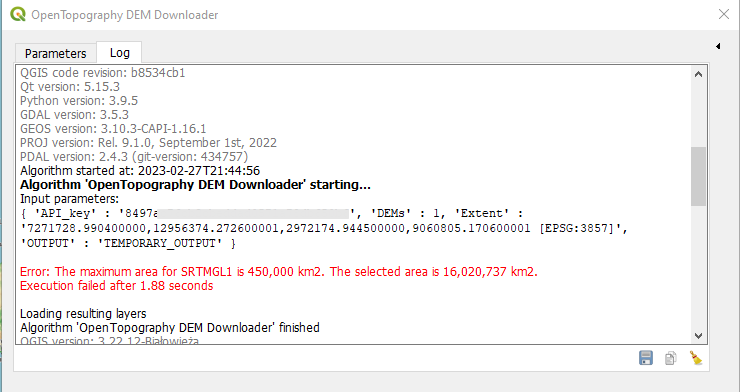
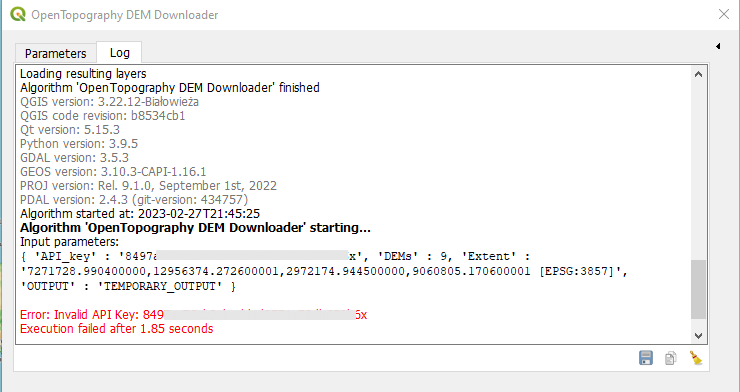

# OpenTopography-DEM-Downloader-qgis-plugin
ver-2
QGIS plugin to dwonload DEMs from OpenTopography.org

This plug-in allows you to download DEMs from OpenTopgraphy.org by specifying area extent in QGIS. The downloaded DEM wil just cover the defined extent.

The tool can be used in modeller with layer extent as input. Code is contributed by [suricactus](https://github.com/suricactus)

  1 . a Layer in the content
  2 . current canvas extent
  3 . user specified extent drawn on the canvas
  
DEMs availables to donwload:
  1. SRTM 90m [read details](https://portal.opentopography.org/raster?opentopoID=OTSRTM.042013.4326.1)
  2. SRTM 30m [read details](https://portal.opentopography.org/raster?opentopoID=OTSRTM.082015.4326.1)
  3. ALOS World 3D 30m [read details](https://portal.opentopography.org/raster?opentopoID=OTALOS.112016.4326.2)
  4. SRTM GL1 Ellipsoidal 30m [read details](https://portal.opentopography.org/raster?opentopoID=OTSRTM.082016.4326.1)
  5. Global Bathymetry SRTM15+ V2.1 [read details](https://portal.opentopography.org/raster?opentopoID=OTSRTM.122019.4326.1)
  6. Copernicus Global DSM 30m [read details](https://portal.opentopography.org/raster?opentopoID=OTSDEM.032021.4326.3)
  7. Copernicus Global DSM 90m [read details](https://portal.opentopography.org/raster?opentopoID=OTSDEM.032021.4326.1)
  8. NASADEM Global DEM [read details](https://portal.opentopography.org/raster?opentopoID=OTSDEM.032021.4326.2)
  9. EU DTM [read details](https://portal.opentopography.org/datasetMetadata?otCollectionID=OT.092022.3035.1)
  10. GEDI L3 1km [read details](https://portal.opentopography.org/datasetMetadata?otCollectionID=OT.032022.4326.1)

** You will need an API Key to download these DEMs as per requirement of the OpenTopography.org.
Read detail insturction to get an API Key here.. https://opentopography.org/blog/introducing-api-keys-access-opentopography-global-datasets

## Extent limitations
There is a limit on extent in a request.

According the OpenTopgraphy.org the extent limits are as follow..
 - 125,000,000 km2 for SRTM15+ V2.1, 
 - 4,050,000 km2 for SRTM GL3, COP90 and 
 - 450,000 km2 for all other data

In this version, the tool will respons with more information about the error.

Exceed coverage limit error

API Key error

## How to check whether my API key is working or not
You can test if your API key is ok or not with the below html request. Add your api key at the place of "YOUR_API_KEY" and copy the whole link, paste into the address box of a browser and strike Enter key. It should download a small DEM. (ref: https://opentopography.org/blog/introducing-api-keys-access-opentopography-global-datasets)

https://portal.opentopography.org/API/globaldem?demtype=NASADEM&south=45&north=46&west=-122&east=-121&outputFormat=GTiff&API_Key=YOUR_API_KEY

If you dont get a dem download via the above link then your API key is incorrect/wrong (trimmed or extra space). 
